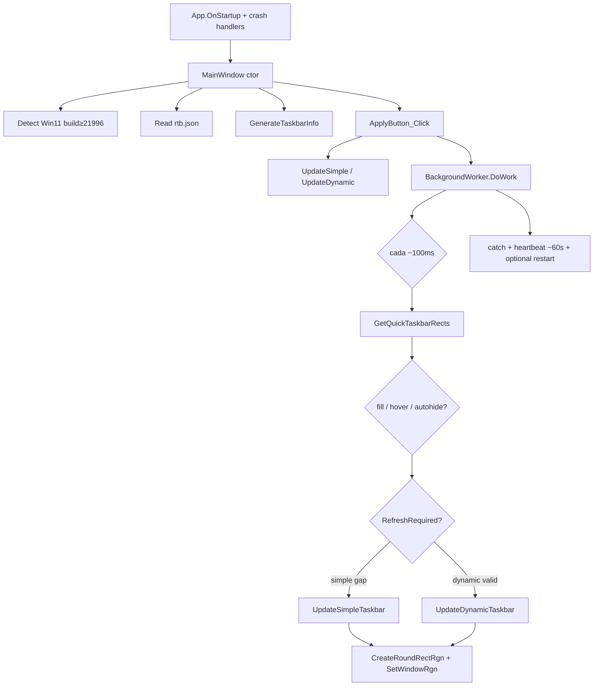

# RoundedTB — Mapa de arquitectura (fork local)

Base upstream: [Gniang/RoundedTB](https://github.com/Gniang/RoundedTB) @ `b78e5d6`  
**Historial de fixing / handoff:** [`FIXING.md`](FIXING.md) · **Agentes:** [`AGENTS.md`](AGENTS.md)

## Qué es

Utilidad WPF que redondea/recorta la taskbar **sin patch permanente**: localiza `Shell_TrayWnd`, mide AppList/Tray y aplica `SetWindowRgn` en un loop ~100 ms.

## Stack

| Ítem | Valor |
|------|--------|
| TFM | `net10.0-windows10.0.19041.0` |
| UI | WPF + WinForms + WPF-UI 1.2.1 |
| Config | `%LocalAppData%\rtb.json` |
| Log | `%LocalAppData%\rtb.log` |
| Measure | Win32 HWND + UIA `TaskbarFrame` (fast path vía `InputSite`) |

## Flujo runtime

## Módulos

| Archivo | Rol |
|---------|-----|
| `App.xaml.cs` | Startup/Exit, unhandled exceptions → log |
| `MainWindow.xaml.cs` | UI, tray, Apply/Close, `DataLock`, worker lifecycle |
| `Background.cs` | Polling, hover snapshot, fade steps, supervivencia |
| `Taskbar.cs` | Discovery + regiones GDI (ownership correcto) |
| `Types.cs` / `AppListXaml` | Settings + medida UIA |
| `Interaction.cs` | JSON, logging, TranslucentTB bridge |
| `LocalPInvoke.cs` | Win32/GDI/DWM |

Dead code eliminado: `AppBars`, `IAppVisibility`, `TaskbarEffect`.

## Hotspots

| ID | Tema | Estado |
|----|------|--------|
| P0 | Ownership GDI post-`SetWindowRgn` | Hecho |
| P0 | `AppListXaml` fast path + fallback | Hecho |
| P1 | Sync `taskbarDetails` / settings (`DataLock` + Clone) | Hecho |
| P1 | Fade sin `Sleep` bloqueante | Hecho |
| P2 | Tray rect monitores secundarios | Hecho |
| P2 | net8 + limpieza deps/dead code | Hecho |
| P3 | Logging + crash handlers + worker restart | Hecho |
| P3b | Restore taskbars on every exit path | Hecho (`RestoreAllTaskbars`) |
| P3c | Dynamic clamp vs tray (no freeze) | Hecho (`ClampAppListAwayFromTray`) |
| P3d | AutoHide no toca ABS_AUTOHIDE nativo | Hecho |
| P3e | Native AH: freeze RGN en peek/slide (no hit-strip) | Hecho (torchgm #36) |
| P3f | Fade RTB rápido (2 steps + fast poll) | Hecho |
| P3g | ShowSegmentsOnHover solo en transición | Hecho |
| Next | UIA/STA robustness | Abierto — ver FIXING §8 |

## Decisión de diseño

Seguir con **SetWindowRgn + hardening**. DWM corners no sustituyen márgenes/segmentos.

## Orden de lectura

1. `FIXING.md` (contexto y trampas)
2. `MainWindow` ctor + `Apply` + `OnClosing`
3. `Background.DoWork`
4. `Taskbar.GenerateTaskbarInfo` → `UpdateSimple` / `UpdateDynamic`
5. `Types.AppListXaml`
6. Callers de `SetWindowRgn` / `CreateRoundRectRgn`
